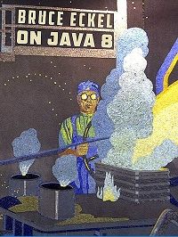

# 说明

本项目 Fork 自 [LingCoder/OnJava8](https://github.com/lingcoder/OnJava8)，仅作为 GitBook 版本，如果想要贡献项目或者是加入相关组群交流，请移步原仓库。

* GitHub 阅读：[进入](https://github.com/reniie/OnJava8/tree/master/SUMMARY_GITHUB.md)
* GitBook 阅读：[进入](https://renie.gitbook.io/on-java-8)

## 《On Java 8》中文版

以下内容是原仓库的描述。

### 书籍简介

* 本书原作者为 \[美\] Bruce Eckel，即《Java 编程思想》的作者。
* 本书是事实上的 《Java 编程思想》第五版。
* 《Java 编程思想》第四版基于 JAVA **5** 版本；《On Java 8》 基于 JAVA **8** 版本。

### 翻译进度

* [x] [前言](00-Preface.md)
* [x] [简介](00-Introduction.md)
* [x] [第一章 对象的概念](01-what-is-an-object.md)
* [x] [第二章 安装 Java 和本书用例](02-installing-java-and-the-book-examples.md)
* [x] [第三章 万物皆对象](03-objects-everywhere.md)
* [x] [第四章 运算符](04-operators.md)
* [x] [第五章 控制流](05-control-flow.md)
* [x] [第六章 初始化和清理](06-housekeeping.md)
* [x] [第七章 封装](07-implementation-hiding.md)
* [x] [第八章 复用](08-reuse.md)
* [x] [第九章 多态](09-polymorphism.md)
* [x] [第十章 接口](10-interfaces.md)
* [x] [第十一章 内部类](11-inner-classes.md)
* [x] [第十二章 集合](12-collections.md)
* [x] [第十三章 函数式编程](13-functional-programming.md)
* [x] [第十四章 流式编程](14-streams.md)
* [x] [第十五章 异常](15-exceptions.md)
* [x] [第十六章 代码校验](16-validating-your-code.md)
* [x] [第十七章 文件](17-files.md)
* [x] [第十八章 字符串](18-strings.md)
* [x] [第十九章 类型信息](19-type-information.md)
* [x] [第二十章 泛型](20-generics.md)
* [x] [第二十一章 数组](21-arrays.md)
* [x] [第二十二章 枚举](22-enumerations.md)
* [x] [第二十三章 注解](23-annotations.md)
* [x] [第二十四章 并发编程](24-concurrent-programming.md)
* [ ] [第二十五章 设计模式](25-patterns.md)
* [x] [附录:补充](appendix-supplements.md)
* [x] [附录:编程指南](appendix-programming-guidelines.md)
* [x] [附录:文档注释](appendix-javadoc.md)
* [ ] [附录:对象传递和返回](appendix-passing-and-returning-objects.md)
* [x] [附录:流式 IO](appendix-io-streams.md)
* [x] [附录:标准 IO](appendix-standard-io.md)
* [x] [附录:新 IO](appendix-new-io.md)
* [x] [附录:理解 equals 和 hashCode 方法](appendix-understanding-equals-and-hashcode.md)
* [x] [附录:集合主题](appendix-collection-topics.md)
* [x] [附录:并发底层原理](appendix-low-level-concurrency.md)
* [x] [附录:数据压缩](appendix-data-compression.md)
* [x] [附录:对象序列化](appendix-object-serialization.md)
* [ ] [附录:静态语言类型检查](appendix-benefits-and-costs-of-static-type-checking.md)
* [x] [附录:C++ 和 Java 的优良传统](appendix-the-positive-legacy-of-c-plus-plus-and-java.md)
* [ ] [附录:成为一名程序员](appendix-becoming-a-programmer.md)

### 原书资料

* 作者: Bruce Eckel
* ISBN: 9780981872520
* 页数：2038
* 发行：仅电子版

### 示例代码

* [gradle: OnJava8-Examples](https://github.com/BruceEckel/OnJava8-Examples)
* [maven: OnJava8-Examples-Maven](https://github.com/sjsdfg/OnJava8-Examples-Maven)

### 贡献者

* 主译：[LingCoder](https://github.com/LingCoder)，[sjsdfg](https://github.com/sjsdfg)，[xiangflight](https://github.com/xiangflight)
* 参译：[Langdon-Chen](https://github.com/Langdon-Chen)，[1326670425](https://github.com/1326670425)，[LortSir](https://github.com/LortSir)
* 校对：[LingCoder](https://github.com/LingCoder)，[jason31520](https://github.com/jason31520)，[xiangflight](https://github.com/xiangflight)，[nickChenyx](https://github.com/nickChenyx)

### 翻译说明

1. 本书排版布局和翻译风格上参考**阮一峰**老师的 [中文技术文档的写作规范](https://github.com/ruanyf/document-style-guide)
2. 采用第一人称叙述。
3. 由于中英行文差异，完全的逐字逐句翻译会很冗余啰嗦。所以本人在翻译过程中，去除了部分主题无关内容、重复描写。
4. 译者在翻译中同时参考了谷歌、百度、有道翻译的译文以及《Java 编程思想》第四版中文版的部分内容（对其翻译死板，生造名词，语言精炼度差问题进行规避和改正）。最后结合译者自己的理解进行本地化，尽量做到专业和言简意赅，方便大家更好的理解学习。
5. 由于译者个人能力、时间有限，如有翻译错误和笔误的地方，还请大家批评指正！

### 开源协议

本项目基于 MIT 协议开源。

